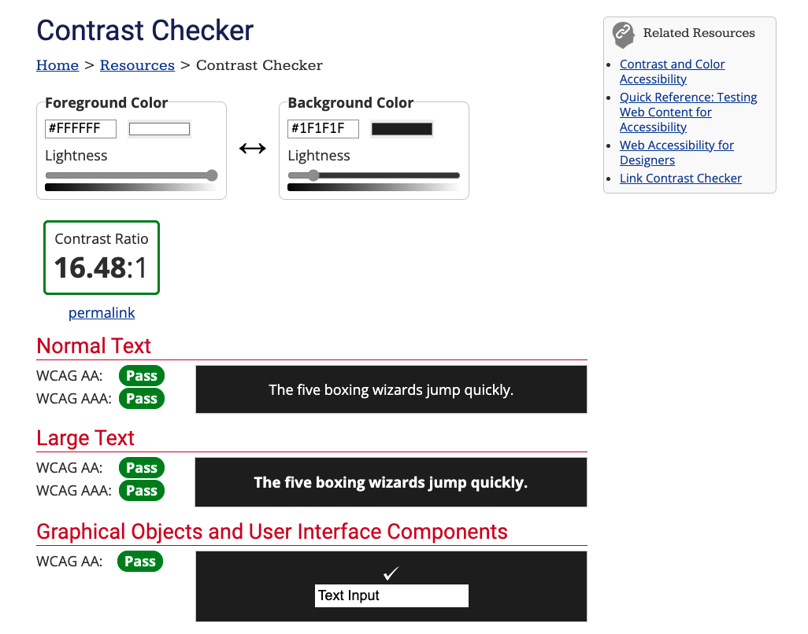
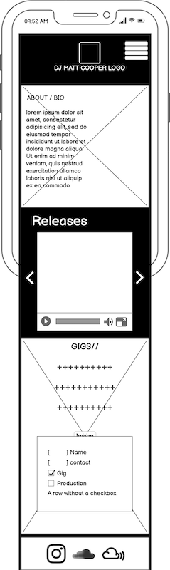
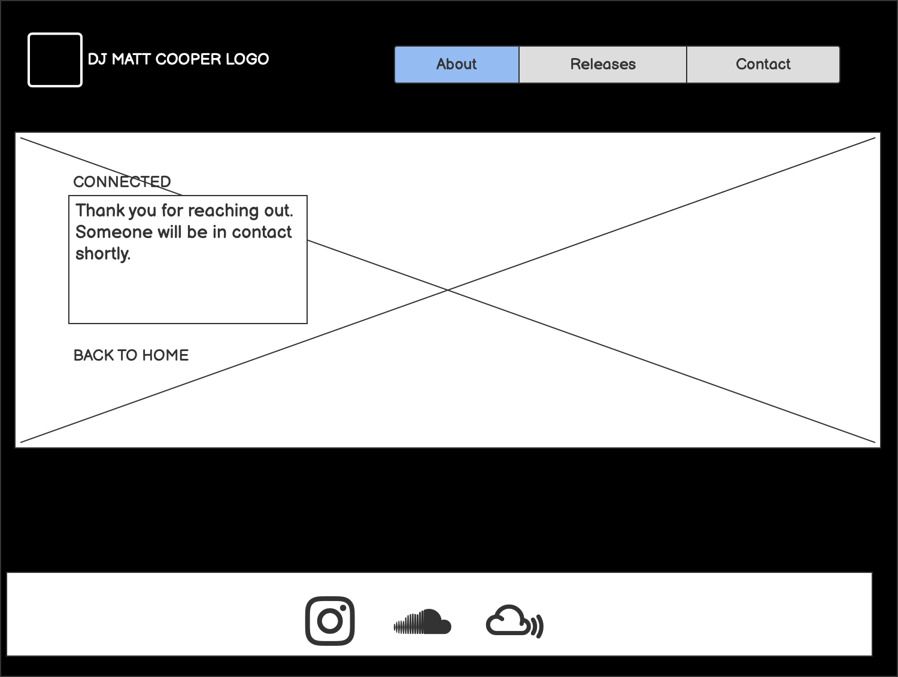
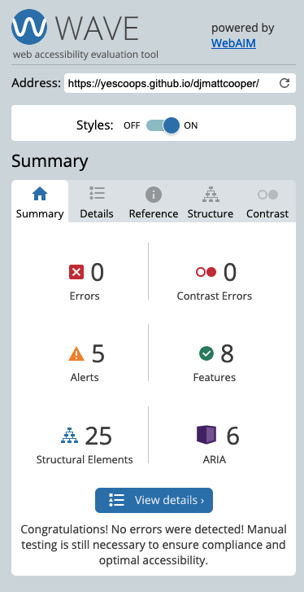
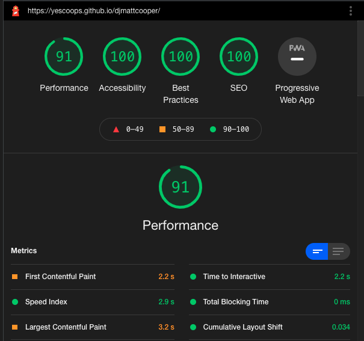
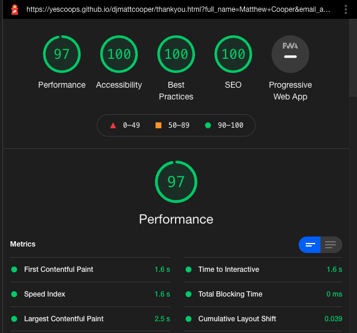

 

[View the live project here.](https://yescoops.github.io/djmattcooper/)

This is the main marketing website for DJ Matt Cooper. It is designed to be responsive and accessible on a range of devices, making it easy to navigate for current and potential fans and employers.

---


---

## User Experience (UX)

-   ### User stories

    -   #### First Time Visitor Goals

        1. As a First Time Visitor, I want to easily understand the main purpose of the site and learn more about DJ Matt Cooper.
        2. As a First Time Visitor, I want to be able to easily navigate throughout the site to find content.
        3. As a First Time Visitor, I want to look for examples of the style of music Matt plays and see if they have legitimacy. I also want to locate his social media links to see their followings on social media to guage their popularity and activity.

    -   #### Returning Visitor Goals

        1. As a Returning Visitor, I want to find information about his gig diary.
        2. As a Returning Visitor, I want to find the best way to get in contact with Matt with any booking or production requests I may have.
        3. As a Returning Visitor, I want to find community links.

    -   #### Frequent User Goals
        1. As a Frequent User, I want to check to see if there are any newly added media (such as releases or mixes) or gigs.

-   ### Design
    -   #### Colour Scheme
        -   The two main colours used are black (#1f1f1f) and white (#fffffffa), with a red (#f11616) used as focus in the anchor and form inputs. This contrast is passes WCGA AA and AAA requirements.
        
    -   #### Layout
        -  A simple scrolling page gives this site a clean, minimalist feel which creates the desired effect for the Artist. As the content focus is music, the lack of text deemed several pages to be uneccesary. 
    -   #### Typography
        -   The Roboto and Radjhani fonts are the chosen fonts used throughout the whole website with Sans Serif as the fallback font in case for any reason the font isn't being imported into the site correctly. Roboto is a clean, futuristic style font that suits the styling of the website, with Radjhani being suggested by Google fonts as a contrasting pair to use along with it. 
    -   #### Imagery
        -   Imagery is important. The large, background hero image is designed to be striking and catch the user's attention. It also has a modern, clean aesthetic that pertains to the anonymity of both the artist and the underground electronic music scene.

---

*   ### Wireframes

    -   Home Page Wireframe - 
    

    -   Mobile Wireframe - 

        

    -   Thank you page Wireframe - 

     

    As you can see from the Wireframes, the initial layout of the Site was slightly different. The evolution of the layout came about through testing and understanding the UX as the build developed:

    - The addition of a separate area for Gig information on the Desktop view allowed more focus to the Connect form and the desire for users to input their data. 

    - The removal of the email address in the Connect section so Users will be more drawn to use the form. 

    - The cursor scrolling of the iframes in the mobile view of the releases section due to limitations in the CSS to do this in a responsive way. 

    - The use of a hamburger icon for the navbar menu when on smaller screens due to the limitations in CSS. 

---

## Features

-   Responsive on all device sizes

-   Interactive elements

### Languages Used

-   [HTML5](https://en.wikipedia.org/wiki/HTML5)
-   [CSS3](https://en.wikipedia.org/wiki/Cascading_Style_Sheets)

### Frameworks, Libraries & Programs Used

1. [Google Fonts:](https://fonts.google.com/)
    - Google fonts were used to import the 'Roboto' and 'Radjhani' fonts into the style.css file which is used on all pages throughout the project.
1. [Font Awesome:](https://fontawesome.com/)
    - Font Awesome was used on all pages throughout the website to add icons for aesthetic and UX purposes.
1. [Git](https://git-scm.com/)
    - Git was used for version control by utilizing the Gitpod terminal to commit to Git and Push to GitHub.
1. [GitHub:](https://github.com/)
    - GitHub is used to store the projects code after being pushed from Git.
1. [Balsamiq:](https://balsamiq.com/)
    - Balsamiq was used to create the [wireframes](https://github.com/) during the design process.

---

## Testing

The W3C Markup Validator and W3C CSS Validator Services were used to validate all pages of the project to ensure there were no syntax errors in there. 

-   W3C Markup Validator - [Results for Main Page](https://validator.w3.org/nu/?doc=https%3A%2F%2Fyescoops.github.io%2Fdjmattcooper%2F) - [Results for Thankyou Page](https://validator.w3.org/nu/?doc=https%3A%2F%2Fyescoops.github.io%2Fdjmattcooper%2Fthankyou.html)

-   W3C CSS Validator - [Results for Main Page](https://jigsaw.w3.org/css-validator/validator?uri=https%3A%2F%2Fyescoops.github.io%2Fdjmattcooper%2F&profile=css3svg&usermedium=all&warning=1&vextwarning=&lang=en) - [Results for Thankyou Page](https://jigsaw.w3.org/css-validator/validator?uri=https%3A%2F%2Fyescoops.github.io%2Fdjmattcooper%2Fthankyou.html&profile=css3svg&usermedium=all&warning=1&vextwarning=&lang=en)

## Accessibility Testing

The site was throughly checked for any possible accessibility issues. Below is the [WAVE](https://wave.webaim.org/) report:



## Performance

The site was checked with Google Developments' Lighthouse tool. Below are the results:

- Main Page



- Thankyou Page



---

### Testing User Stories from User Experience (UX) Section

-   #### First Time Visitor Goals

    1. As a First Time Visitor, I want to easily understand the main purpose of the site and learn more about DJ Matt Cooper.

        1. Upon entering the site, users are automatically greeted with a clean and easily readable navigation bar to go to the section of their choice. The use of a clean underline animation when hovering over a link emphasises where the User is. Underneath there is a Hero Image with text about the Site and a "Reach Out" Call to action button.
        2. The main points are made immediately with the hero image and associated text.
        3. The user has two options, click the animated call to action button (which highlights in red to emphasise the link to the connect form) or scroll down, both of which will lead to the same place, to learn more about the Artist.

    2. As a First Time Visitor, I want to be able to easily navigate throughout the site to find content.

        1. The site has been designed to be fluid and never to entrap the user. At the top of the page there is a clean navigation bar, each link describes what section they will end up at clearly.
        2. At the bottom of the page there is a redirection call to action in the form of social links to ensure the user always has somewhere to go and doesn't feel trapped as they get to the bottom of the page.
        3. In the Connect section, after a form response is submitted, the page refreshes and the user is brought to a thank you page, allowing them to return to the top of the home page via a link or via the navbar. For sylistic purposes, the from method was set from "POST" to "GET" so you can see the styling of the Thankyou page. This renders the form from collating inputted data and would need to be resolved before deployment. 

    3. As a First Time Visitor, I want to look for examples of the style of music Matt plays and see if they have legitimacy. I also want to locate his social media links to see their followings on social media to guage their popularity and activity.

        1. Once the new visitor has read the cover text, they will notice the 'Reach Out' link which takes them to the Connect and social section.
        2. The user can also scroll to the bottom of any page on the site to locate social media links in the footer.
    

-   #### Returning Visitor Goals

    1. As a Returning Visitor, I want to find information about Matts gig diary.

        1. These are clearly shown in the gigs section of the page.
        2. Immediately below this information is the connect section where a User can reach out for more information. 

    2. As a Returning Visitor, I want to find the best way to get in contact with Matt with any booking or production requests I may have.

        1. The navigation bar clearly highlights the "Connect" section.
        2. Here they can fill out the form on the page or can follow the social links below the form.
     
    3. As a Returning Visitor, I want to find community links.
        1. The footer contains links to the organisations Instagram, Soundcloud and Mixcloud pages.
        2. Whichever link they click, it will be open up in a new tab to ensure the user can easily get back to the website.
       

-   #### Frequent User Goals

    1. As a Frequent User, I want to check to see if there are any newly added media (such as releases or mixes) or gigs.

        1. The user would already be comfortable with the website layout and can easily click relative links to the releases, gigs or social sections.


### Further Testing

-   The Website was tested on Google Chrome, Firefox, Microsoft Edge and Safari browsers.
-   The Website was tested through Responsinator [(results here)](https://www.responsinator.com/?url=https%3A%2F%2Fyescoops.github.io%2Fdjmattcooper%2F) to check any responsiveness issues. 
-   The website was viewed on a variety of devices such as Desktop, Apple Laptop, Oppo G13 mobile, iPhone 8 & iPhoneX.
-   A large amount of testing was done to ensure that all pages were linking correctly.
-   Friends and family members were asked to review the site and documentation to point out any bugs and/or user experience issues.

### Known Bugs

-   On a mobile device in landscape view, the anchor text within the cover text does not resize correctly. 

---
  
## Deployment

### GitHub Pages

The project was deployed to GitHub Pages using the following steps...

1. Log in to GitHub and locate the [GitHub Repository](https://github.com/)
2. At the top of the Repository (not top of page), locate the "Settings" Button on the menu.
    - Alternatively Click [Here](https://raw.githubusercontent.com/) for a GIF demonstrating the process starting from Step 2.
3. Scroll down the Settings page until you locate the "GitHub Pages" Section.
4. Under "Source", click the dropdown called "None" and select "Master Branch".
5. The page will automatically refresh.
6. Scroll back down through the page to locate the now published site [link](https://github.com) in the "GitHub Pages" section.

### Forking the GitHub Repository

By forking the GitHub Repository we make a copy of the original repository on our GitHub account to view and/or make changes without affecting the original repository by using the following steps...

1. Log in to GitHub and locate the [GitHub Repository](https://github.com/)
2. At the top of the Repository (not top of page) just above the "Settings" Button on the menu, locate the "Fork" Button.
3. You should now have a copy of the original repository in your GitHub account.

### Making a Local Clone

1. Log in to GitHub and locate the [GitHub Repository](https://github.com/)
2. Under the repository name, click "Clone or download".
3. To clone the repository using HTTPS, under "Clone with HTTPS", copy the link.
4. Open Git Bash
5. Change the current working directory to the location where you want the cloned directory to be made.
6. Type `git clone`, and then paste the URL you copied in Step 3.

```
$ git clone https://github.com/YOUR-USERNAME/YOUR-REPOSITORY
```

7. Press Enter. Your local clone will be created.

```
$ git clone https://github.com/YOUR-USERNAME/YOUR-REPOSITORY
> Cloning into `CI-Clone`...
> remote: Counting objects: 10, done.
> remote: Compressing objects: 100% (8/8), done.
> remove: Total 10 (delta 1), reused 10 (delta 1)
> Unpacking objects: 100% (10/10), done.
```

Click [Here](https://help.github.com/en/github/creating-cloning-and-archiving-repositories/cloning-a-repository#cloning-a-repository-to-github-desktop) to retrieve pictures for some of the buttons and more detailed explanations of the above process.

---

## Credits

### Code

-   The CSS underline animation came from here: (https://paulund.co.uk/css-animation-link-underline)


### Content

-   All content was written by the Author, Matt Cooper.

### Media

-   All Images were created or owned by the developer.

### Acknowledgements

-   My Mentor Antonio Rodriguez for his continuous helpful feedback.

-   My partner Mor for her testing, suggestions and support throughout this build. 
